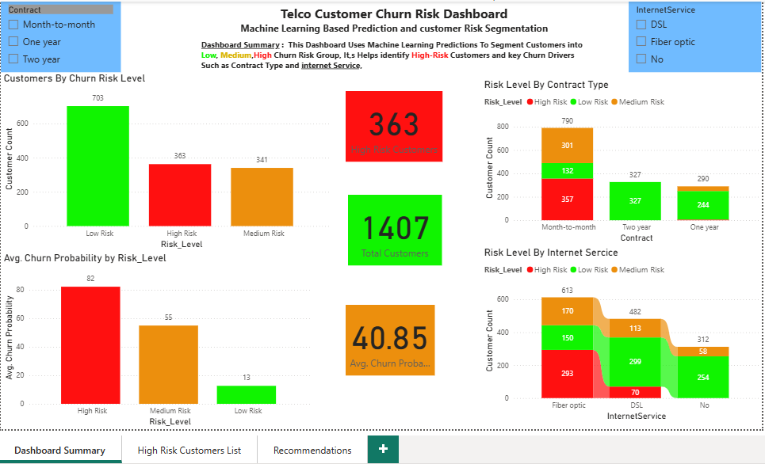

# Telco Customer Churn Prediction and Risk Segmentation

## Project Overview

This project focuses on predicting customer churn for a telecommunications company using machine learning. The main goal is to identify customers who are likely to leave the company and segment them into Low, Medium, and High Risk groups based on their predicted churn probability.

The project includes data cleaning, exploratory data analysis, feature engineering, machine learning model building, model evaluation, churn probability prediction, risk segmentation, and Power BI dashboard development.

## Dataset

The dataset contains customer information such as demographics, contract type, internet service, payment method, tenure, monthly charges, total charges, and churn status.

Key columns include:

- Customer ID
- Gender
- Senior Citizen
- Partner
- Dependents
- Tenure
- Internet Service
- Contract Type
- Payment Method
- Monthly Charges
- Total Charges
- Churn

## Data Cleaning

The data cleaning process included checking missing values, converting the `TotalCharges` column from object type to numeric, handling invalid values, removing missing records, and preparing the target variable for machine learning.

The `Churn` column was converted into a binary format:

- 0 = No Churn
- 1 = Churn

## Exploratory Data Analysis

Several exploratory analyses were performed to understand churn behaviour across different customer groups. The analysis showed that:

- Customers with month-to-month contracts had the highest churn rate.
- Fiber optic customers showed higher churn risk compared to DSL and customers without internet service.
- Customers with shorter tenure were more likely to churn.
- Higher monthly charges were associated with higher churn risk.
- Customers using electronic check payment showed higher churn behaviour.

## Feature Engineering

Several new features were created to improve analysis and model interpretation, including:

- Tenure groups
- Monthly charge groups
- Internet service indicator
- Automatic payment indicator
- Contract risk level

These features helped transform raw customer information into more meaningful business categories.

## Machine Learning Models

Multiple classification models were trained and evaluated, including:

- Logistic Regression
- Decision Tree
- Random Forest
- K-Nearest Neighbors
- Support Vector Machine

Class imbalance was handled using class weighting and SMOTE oversampling.

## Model Evaluation

Since churn prediction is an imbalanced classification problem, recall and F1-score for the churn class were considered more important than accuracy alone.

The final selected model was Logistic Regression with SMOTE because it provided a strong balance between recall, F1-score, and interpretability.

## Churn Risk Segmentation

The final model was used to generate churn probability scores for customers. These probabilities were converted into three risk levels:

- Low Risk: less than 40%
- Medium Risk: 40% to 70%
- High Risk: above 70%

The test set was segmented as follows:

- Low Risk: 703 customers
- Medium Risk: 341 customers
- High Risk: 363 customers

## Power BI Dashboard

A Power BI dashboard was created to present the model results and business insights. The dashboard includes:

- Total customers
- High-risk customers
- Average churn probability
- Customers by churn risk level
- Risk level by contract type
- Risk level by internet service
- High-risk customer action list
- Business recommendations

## Key Dashboard Insights

The dashboard showed that month-to-month customers have the highest churn risk, while two-year contract customers are mostly low risk. This suggests that longer-term contracts may help reduce customer churn.

The dashboard also showed that fiber optic customers have the highest number of high-risk churn predictions. This indicates that internet service type is an important factor in customer churn behaviour.

## Business Recommendations

Based on the analysis and model results, the company should:

1. Prioritise high-risk customers for retention campaigns.
2. Encourage month-to-month customers to move to longer-term contracts.
3. Investigate churn drivers among fiber optic customers.
4. Improve customer experience for customers using electronic check payment.
5. Use churn probability scores to rank customers and target retention actions more effectively.

## Tools Used

- Python

- Pandas

- NumPy

- Matplotlib

- Seaborn

- Scikit-learn

- imbalanced-learn

- Power BI

- VS Code / Jupyter Notebook

## Project Outcome

This project demonstrates how machine learning can be used not only to predict customer churn but also to support business decision-making through customer risk segmentation and dashboard reporting.

## Author :
** Sasan Bayani **
Data Scientist ** Machine Learning ** Data Analysis ** Power Bi
Thanks 

